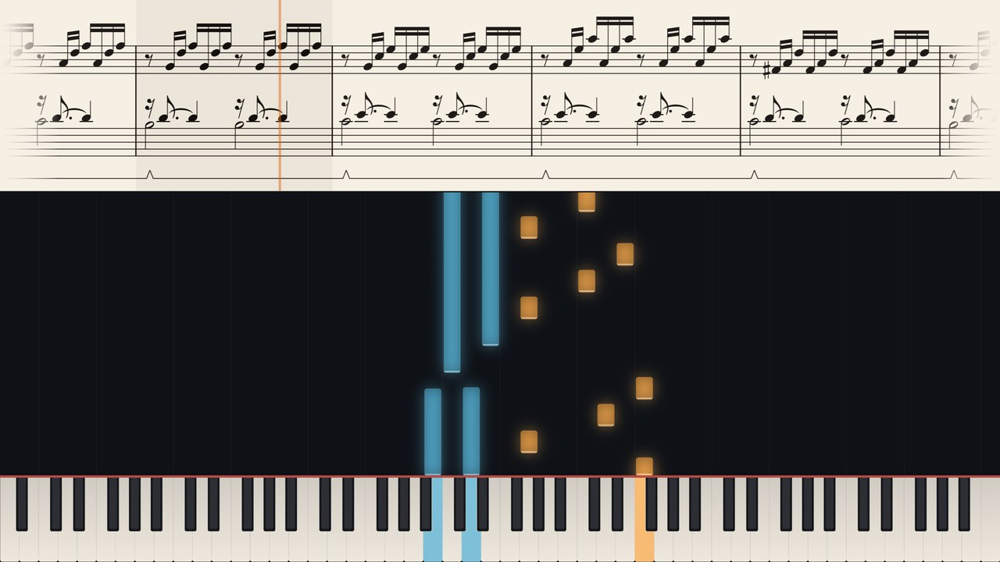

# MSCZtoMP4

Turn a MuseScore score into a piano video, ready for YouTube:

- falling notes onto an 88-key keyboard, upper staff in amber and lower staff in blue
- the score scrolling along the top, with a playhead and the current bar highlighted
- a title card from the score's title frame
- MuseScore's own audio, in sync with the picture



*A frame from [`examples/demo.mscz`](examples/demo.mscz) (J. S. Bach, Prelude in C major BWV 846, bars 1–19).*

Everything comes from MuseScore's own exports, so the video plays exactly what you hear in MuseScore:
tempo changes, dynamics and pedalling, including hidden tempo and dynamic marks.

## Requirements

- [MuseScore 4](https://musescore.org) (free). Tested with MuseScore 4.7.5.
- Python 3.10 or newer.
- ffmpeg is **not** needed separately: a copy comes with the `imageio-ffmpeg` dependency. If you already have
  ffmpeg on your `PATH`, that one is used.

Tested on Windows 10. macOS and Linux should work but have not been tested yet; reports are welcome.

## Install

With [pipx](https://pipx.pypa.io) (keeps the tool and its dependencies in their own environment):

```
pipx install git+https://github.com/dxpawn/MSCZtoMP4
```

or with pip: `pip install git+https://github.com/dxpawn/MSCZtoMP4`.

Then check that it finds everything:

```
mscz2mp4 --check
```

If MuseScore is installed somewhere unusual, pass its path with `--mscore` or set the `MUSESCORE` environment
variable (on Windows, it is `MuseScore4.exe` in the `bin` folder of the install).

## Usage

```
mscz2mp4 "My Piece.mscz"
```

writes `My Piece.mp4` next to the score. Before rendering the whole piece, try a few frames or a short clip:

```
mscz2mp4 "My Piece.mscz" --still 0 30 95     # PNG frames at 0:00, 0:30 and 1:35 of the music
mscz2mp4 "My Piece.mscz" --preview 90 20     # a 20-second clip with audio, from 1:30
mscz2mp4 "My Piece.mscz" --strip dark        # dark score strip instead of light paper
mscz2mp4 "My Piece.mscz" --res 1920x1080 --fps 30 -o out.mp4
```

`python -m mscz2mp4 …` works the same way.

| Option | Default | |
|---|---|---|
| `-o`, `--out FILE` | the score's name, `.mp4` | Output file. |
| `--res WxH` | `2560x1440` | Video size. YouTube gives 1440p uploads a much higher bitrate (VP9) than 1080p, so 1440p looks better even on a 1080p screen. |
| `--fps N` | `60` | Frames per second. |
| `--crf N` | `16` | H.264 quality: lower is better and bigger. |
| `--strip light\|dark` | `light` | Score strip colours: cream paper or dark. |
| `--still T …` | | Only write PNG frames at these music times (seconds). |
| `--preview START DUR` | | Only write a short clip with audio (seconds of music time). |
| `--mscore PATH` | found automatically | MuseScore 4 program. Also: the `MUSESCORE` environment variable. |
| `--ffmpeg PATH` | found automatically | ffmpeg program. Also: the `FFMPEG` environment variable. |
| `--cache-dir DIR` | `mscz2mp4-cache` next to the score | Where MuseScore's exports are kept. |
| `--font REGULAR [BOLD [ITALIC]]` | EB Garamond (bundled) | Title card fonts (`.ttf`/`.otf`). |
| `--jobs N` | CPU count − 2 | Render processes. |
| `--check` | | Show the MuseScore, ffmpeg and fonts that will be used, then exit. |

MuseScore is looked for in this order: `--mscore`, `MUSESCORE`, `PATH` (`mscore`, `mscore4`, `musescore`,
`MuseScore4`, `mscore4portable`), the usual install folders (Windows `Program Files`, macOS `/Applications`,
Linux AppImages in `~/Applications`), and finally the Flatpak `org.musescore.MuseScore`.

## Tips

- **Hidden marks are honoured.** Tempo and dynamic marks made invisible in MuseScore still play, so you can
  shape the performance without cluttering the score.
- **The title card** uses the score's title frame: title, subtitle and composer. Without a title frame it uses
  the title, composer and arranger from *File → Project properties*.
- **Two-staff piano scores** work best. Other scores render too: the top staff is drawn in amber and every other
  staff in blue (a warning says so). Notes outside the 88 keys and percussion are left out.
- **Render time:** expect about two to three times the length of the piece at 1440p60 on a desktop CPU. The
  74-second demo took 2½ minutes with 24 render processes. Use `--still` and `--preview` while you adjust the score.
- **Cache:** MuseScore's exports are kept in `mscz2mp4-cache/<score name>/` next to the score (the path is
  printed on every run) and redone automatically when the score changes. Delete the folder whenever you like.

## How it works

1. A copy of the score is switched to continuous view, so MuseScore exports it as one long single-row strip.
2. MuseScore exports, from that copy: the MIDI (notes, velocities and pedal, one track per staff), the
   `.spos`/`.mpos` files (the time of every note position and bar on the strip, which musescore.com uses for
   its score following), the audio as MP3, and the strip as a PNG.
3. The strip's position follows the `.spos` times, smoothed so it glides instead of jumping from note to note.
   MuseScore's PNG resolution option does not map to a fixed scale, so the scale is measured from the image:
   the final barline is the right edge of the last bar.
4. MuseScore's MP3 starts slightly late against its MIDI (about 50 ms). The delay is measured for each export
   by matching the attacks in the audio with the MIDI note onsets, and compensated.
5. Frames are rendered in parallel and piped into ffmpeg (H.264, AAC 320 kb/s).

## Licence

[GNU Affero General Public License v3.0 or later](LICENSE).

The bundled [EB Garamond](https://github.com/octaviopardo/EBGaramond12) font is licensed under the
[SIL Open Font License 1.1](src/mscz2mp4/fonts/OFL.txt). The demo score is a public-domain work by J. S. Bach.
